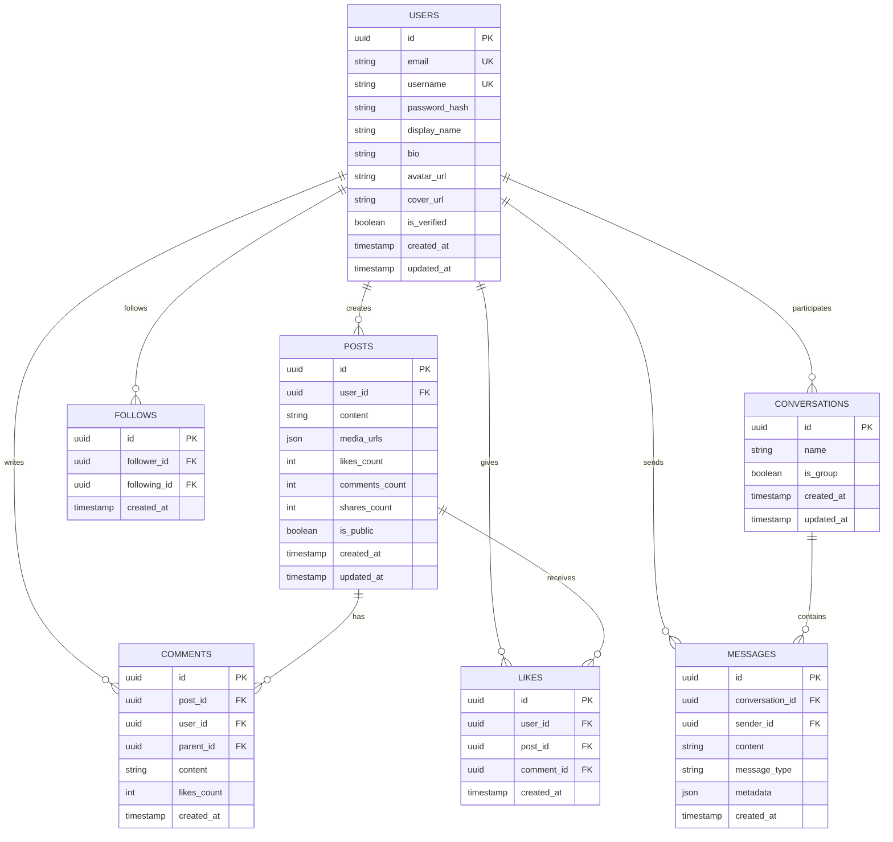

# Documento de Arquitectura Técnica - Red Social CRUNEVO

## 1. Diseño de Arquitectura


## 2. Descripción de Tecnologías

* **Frontend**: React\@18 + TypeScript + Vite + TailwindCSS + Socket.io-client

* **API Gateway**: NestJS + Fastify + JWT Authentication

* **Servicios Backend**: NestJS + Fastify + Prisma ORM + TypeScript

* **Base de Datos**: PostgreSQL\@16 (principal) + Redis\@7 (cache/sesiones)

* **Búsqueda**: OpenSearch\@2.11.1

* **Mensajería**: NATS\@2 (message broker)

* **Almacenamiento**: MinIO (archivos/media)

* **Autenticación**: Keycloak\@24 + JWT

* **Email**: MailHog (desarrollo)

* **Orquestación**: Docker Compose + pnpm + Turbo

## 3. Definiciones de Rutas

| Ruta                      | Propósito                           |
| ------------------------- | ----------------------------------- |
| /                         | Página de inicio con feed principal |
| /login                    | Página de autenticación             |
| /register                 | Página de registro de usuario       |
| /profile/:userId          | Página de perfil de usuario         |
| /messages                 | Página de mensajería y chats        |
| /messages/:conversationId | Chat específico                     |
| /explore                  | Página de exploración y búsqueda    |
| /settings                 | Configuración de cuenta             |
| /settings/privacy         | Configuración de privacidad         |
| /post/:postId             | Vista detallada de post             |

## 4. Definiciones de API

### 4.1 API Principal

**Autenticación de usuarios**

```
POST /api/auth/login
```

Request:

| Nombre Parámetro | Tipo Parámetro | Requerido | Descripción            |
| ---------------- | -------------- | --------- | ---------------------- |
| email            | string         | true      | Email del usuario      |
| password         | string         | true      | Contraseña del usuario |

Response:

| Nombre Parámetro | Tipo Parámetro | Descripción            |
| ---------------- | -------------- | ---------------------- |
| success          | boolean        | Estado de la respuesta |
| token            | string         | JWT token de acceso    |
| user             | object         | Datos del usuario      |

Ejemplo:

```json
{
  "email": "usuario@ejemplo.com",
  "password": "password123"
}
```

**Gestión de Posts**

```
POST /api/posts
GET /api/posts/feed
PUT /api/posts/:id
DELETE /api/posts/:id
```

**Mensajería en Tiempo Real**

```
POST /api/messages
GET /api/conversations
GET /api/conversations/:id/messages
```

**Búsqueda y Exploración**

```
GET /api/search/users?q=:query
GET /api/search/posts?q=:query
GET /api/trending
```

## 5. Diagrama de Arquitectura del Servidor


## 6. Modelo de Datos

### 6.1 Definición del Modelo de Datos



### 6.2 Lenguaje de Definición de Datos

**Tabla de Usuarios (users)**

```sql
-- Crear tabla
CREATE TABLE users (
    id UUID PRIMARY KEY DEFAULT gen_random_uuid(),
    email VARCHAR(255) UNIQUE NOT NULL,
    username VARCHAR(50) UNIQUE NOT NULL,
    password_hash VARCHAR(255) NOT NULL,
    display_name VARCHAR(100) NOT NULL,
    bio TEXT,
    avatar_url VARCHAR(500),
    cover_url VARCHAR(500),
    is_verified BOOLEAN DEFAULT FALSE,
    created_at TIMESTAMP WITH TIME ZONE DEFAULT NOW(),
    updated_at TIMESTAMP WITH TIME ZONE DEFAULT NOW()
);

-- Crear índices
CREATE INDEX idx_users_email ON users(email);
CREATE INDEX idx_users_username ON users(username);
CREATE INDEX idx_users_created_at ON users(created_at DESC);
```

**Tabla de Posts (posts)**

```sql
CREATE TABLE posts (
    id UUID PRIMARY KEY DEFAULT gen_random_uuid(),
    user_id UUID NOT NULL REFERENCES users(id) ON DELETE CASCADE,
    content TEXT NOT NULL,
    media_urls JSONB DEFAULT '[]',
    likes_count INTEGER DEFAULT 0,
    comments_count INTEGER DEFAULT 0,
    shares_count INTEGER DEFAULT 0,
    is_public BOOLEAN DEFAULT TRUE,
    created_at TIMESTAMP WITH TIME ZONE DEFAULT NOW(),
    updated_at TIMESTAMP WITH TIME ZONE DEFAULT NOW()
);

CREATE INDEX idx_posts_user_id ON posts(user_id);
CREATE INDEX idx_posts_created_at ON posts(created_at DESC);
CREATE INDEX idx_posts_is_public ON posts(is_public);
```

**Tabla de Comentarios (comments)**

```sql
CREATE TABLE comments (
    id UUID PRIMARY KEY DEFAULT gen_random_uuid(),
    post_id UUID NOT NULL REFERENCES posts(id) ON DELETE CASCADE,
    user_id UUID NOT NULL REFERENCES users(id) ON DELETE CASCADE,
    parent_id UUID REFERENCES comments(id) ON DELETE CASCADE,
    content TEXT NOT NULL,
    likes_count INTEGER DEFAULT 0,
    created_at TIMESTAMP WITH TIME ZONE DEFAULT NOW()
);

CREATE INDEX idx_comments_post_id ON comments(post_id);
CREATE INDEX idx_comments_user_id ON comments(user_id);
CREATE INDEX idx_comments_parent_id ON comments(parent_id);
```

**Tabla de Likes (likes)**

```sql
CREATE TABLE likes (
    id UUID PRIMARY KEY DEFAULT gen_random_uuid(),
    user_id UUID NOT NULL REFERENCES users(id) ON DELETE CASCADE,
    post_id UUID REFERENCES posts(id) ON DELETE CASCADE,
    comment_id UUID REFERENCES comments(id) ON DELETE CASCADE,
    created_at TIMESTAMP WITH TIME ZONE DEFAULT NOW(),
    CONSTRAINT likes_target_check CHECK (
        (post_id IS NOT NULL AND comment_id IS NULL) OR
        (post_id IS NULL AND comment_id IS NOT NULL)
    )
);

CREATE UNIQUE INDEX idx_likes_user_post ON likes(user_id, post_id) WHERE post_id IS NOT NULL;
CREATE UNIQUE INDEX idx_likes_user_comment ON likes(user_id, comment_id) WHERE comment_id IS NOT NULL;
```

**Tabla de Seguimientos (follows)**

```sql
CREATE TABLE follows (
    id UUID PRIMARY KEY DEFAULT gen_random_uuid(),
    follower_id UUID NOT NULL REFERENCES users(id) ON DELETE CASCADE,
    following_id UUID NOT NULL REFERENCES users(id) ON DELETE CASCADE,
    created_at TIMESTAMP WITH TIME ZONE DEFAULT NOW(),
    CONSTRAINT follows_self_check CHECK (follower_id != following_id)
);

CREATE UNIQUE INDEX idx_follows_unique ON follows(follower_id, following_id);
CREATE INDEX idx_follows_follower ON follows(follower_id);
CREATE INDEX idx_follows_following ON follows(following_id);
```

**Tabla de Conversaciones (conversations)**

```sql
CREATE TABLE conversations (
    id UUID PRIMARY KEY DEFAULT gen_random_uuid(),
    name VARCHAR(100),
    is_group BOOLEAN DEFAULT FALSE,
    created_at TIMESTAMP WITH TIME ZONE DEFAULT NOW(),
    updated_at TIMESTAMP WITH TIME ZONE DEFAULT NOW()
);

CREATE TABLE conversation_participants (
    id UUID PRIMARY KEY DEFAULT gen_random_uuid(),
    conversation_id UUID NOT NULL REFERENCES conversations(id) ON DELETE CASCADE,
    user_id UUID NOT NULL REFERENCES users(id) ON DELETE CASCADE,
    joined_at TIMESTAMP WITH TIME ZONE DEFAULT NOW()
);

CREATE UNIQUE INDEX idx_conversation_participants ON conversation_participants(conversation_id, user_id);
```

**Tabla de Mensajes (messages)**

```sql
CREATE TABLE messages (
    id UUID PRIMARY KEY DEFAULT gen_random_uuid(),
    conversation_id UUID NOT NULL REFERENCES conversations(id) ON DELETE CASCADE,
    sender_id UUID NOT NULL REFERENCES users(id) ON DELETE CASCADE,
    content TEXT NOT NULL,
    message_type VARCHAR(20) DEFAULT 'text',
    metadata JSONB DEFAULT '{}',
    created_at TIMESTAMP WITH TIME ZONE DEFAULT NOW()
);

CREATE INDEX idx_messages_conversation ON messages(conversation_id, created_at DESC);
CREATE INDEX idx_messages_sender ON messages(sender_id);
```

**Datos iniciales**

```sql
-- Usuario administrador por defecto
INSERT INTO users (email, username, password_hash, display_name, is_verified)
VALUES (
    'admin@crunevo.com',
    'admin',
    '$2b$10$example_hash_here',
    'Administrador',
    TRUE
);
```

