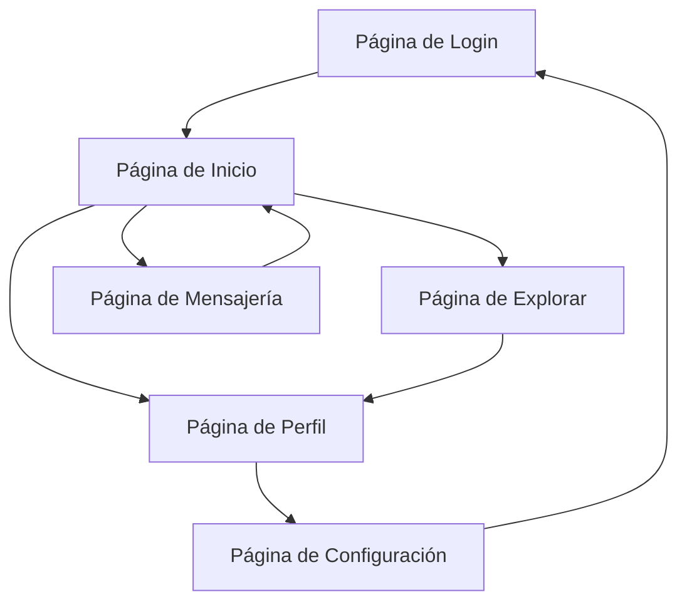

# Documento de Requisitos del Producto - Red Social CRUNEVO

## 1. Descripción General del Producto

CRUNEVO es una plataforma de red social completa y funcional diseñada para conectar usuarios a través de publicaciones, interacciones sociales y comunicación en tiempo real.
- Soluciona la necesidad de una plataforma social moderna con capacidades de desarrollo local, testing robusto y despliegue simplificado.
- Dirigida a desarrolladores que requieren una base sólida para construir aplicaciones sociales escalables.

## 2. Características Principales

### 2.1 Roles de Usuario

| Rol | Método de Registro | Permisos Principales |
|-----|-------------------|---------------------|
| Usuario Regular | Registro por email/OAuth | Crear posts, comentar, seguir usuarios, mensajería |
| Moderador | Invitación por administrador | Moderar contenido, gestionar reportes |
| Administrador | Acceso directo del sistema | Control total, gestión de usuarios y configuración |

### 2.2 Módulos de Funcionalidad

Nuestra red social consta de las siguientes páginas principales:
1. **Página de Inicio**: feed de publicaciones, navegación principal, trending topics
2. **Página de Perfil**: información del usuario, posts del usuario, seguidores/seguidos
3. **Página de Mensajería**: chat en tiempo real, lista de conversaciones, notificaciones
4. **Página de Explorar**: búsqueda de usuarios y contenido, sugerencias
5. **Página de Configuración**: ajustes de cuenta, privacidad, notificaciones
6. **Página de Autenticación**: login, registro, recuperación de contraseña

### 2.3 Detalles de Páginas

| Nombre de Página | Nombre del Módulo | Descripción de Funcionalidad |
|------------------|-------------------|------------------------------|
| Página de Inicio | Feed Principal | Mostrar posts ordenados por relevancia/tiempo, sistema de likes, compartir |
| Página de Inicio | Barra de Navegación | Acceso rápido a todas las secciones, notificaciones en tiempo real |
| Página de Inicio | Crear Post | Editor de texto/multimedia, subida de imágenes/videos, configuración de privacidad |
| Página de Perfil | Información Personal | Mostrar datos del usuario, estadísticas de seguidores, bio editable |
| Página de Perfil | Timeline Personal | Posts del usuario con opciones de edición/eliminación |
| Página de Perfil | Sistema de Seguimiento | Botón seguir/no seguir, lista de seguidores y seguidos |
| Página de Mensajería | Chat en Tiempo Real | Mensajes instantáneos, indicadores de lectura, typing indicators |
| Página de Mensajería | Lista de Conversaciones | Historial de chats, búsqueda de conversaciones |
| Página de Explorar | Búsqueda Avanzada | Buscar usuarios, posts, hashtags con filtros |
| Página de Explorar | Contenido Trending | Posts populares, usuarios sugeridos |
| Página de Configuración | Ajustes de Cuenta | Cambiar contraseña, información personal, eliminar cuenta |
| Página de Configuración | Configuración de Privacidad | Control de visibilidad de posts, bloqueo de usuarios |
| Página de Autenticación | Login/Registro | Autenticación segura, OAuth, verificación de email |

## 3. Proceso Principal

**Flujo de Usuario Regular:**
1. El usuario se registra/inicia sesión
2. Accede al feed principal y ve contenido relevante
3. Puede crear posts, comentar, dar likes
4. Explora y sigue a otros usuarios
5. Utiliza mensajería para comunicación directa
6. Configura su perfil y preferencias

**Flujo de Moderador:**
1. Accede con permisos especiales
2. Revisa reportes de contenido
3. Modera posts y comentarios inapropiados
4. Gestiona usuarios problemáticos

## 4. Diseño de Interfaz de Usuario

### 4.1 Estilo de Diseño

- **Colores primarios**: #1DA1F2 (azul principal), #14171A (texto oscuro)
- **Colores secundarios**: #657786 (gris), #F7F9FA (fondo claro)
- **Estilo de botones**: Redondeados con hover effects, sombras sutiles
- **Fuente**: Inter, tamaños 14px (texto), 16px (botones), 24px (títulos)
- **Layout**: Diseño de tres columnas, navegación lateral fija
- **Iconos**: Feather icons para consistencia, emojis nativos para reacciones

### 4.2 Resumen de Diseño de Páginas

| Nombre de Página | Nombre del Módulo | Elementos de UI |
|------------------|-------------------|----------------|
| Página de Inicio | Feed Principal | Cards con bordes redondeados, botones de acción flotantes, scroll infinito |
| Página de Inicio | Barra de Navegación | Sidebar fijo, iconos con badges de notificación, hover states |
| Página de Perfil | Header de Perfil | Imagen de portada, avatar circular, botones de acción prominentes |
| Página de Mensajería | Chat Interface | Burbujas de mensaje diferenciadas, timestamps, indicadores de estado |
| Página de Explorar | Búsqueda | Input con autocompletado, filtros desplegables, grid de resultados |
| Página de Configuración | Formularios | Inputs agrupados, switches para toggles, botones de confirmación |

### 4.3 Responsividad

Diseño mobile-first con adaptación completa para desktop. Optimización táctil para dispositivos móviles con gestos de swipe y tap targets de mínimo 44px.
